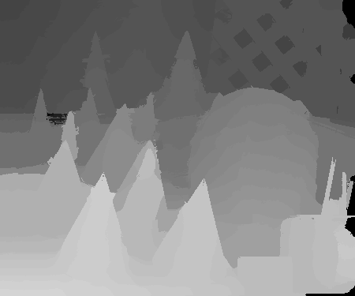
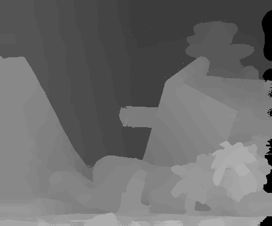
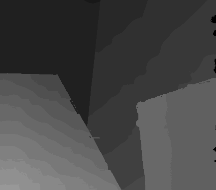
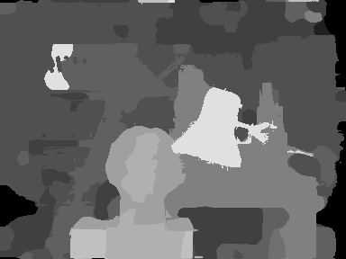

# cv_hw4

## Stereo Matching

### disparity map

| Cones  | Teddy |
| :--------------------------: | :-------------------------: |
|  |  |

| Venus  | Tsukuba |
| :--------------------------: | :-------------------------: |
|  |  |

### algorithm

* cost computation:
  * 1.將照片轉灰階並padding，避免後續找每個pixel的鄰居時超過影像大小。
  * 2.將左右影像各自取得每個pixel周圍5*5做flatten，並將每個值與中心pixel比大小，若小於中心
     pixel則為true，反之為false，將所有結果存入一個與影像相同大小channel數為25的IL_bit及Ir_bit陣
     列中。
  * 3.將IL_bit及Ir_bit計算出L to R及R to L的Hamming distance
  
* cost aggregation:
  * 1.將前面算出來的cost陣列的每個disparity層做joint bilateral filtering
  
* disparity optimization:
  * 1.將filter完的陣列取得每個pixel最大的值作為最後的label
  
* disparity refinement:
  * 1.利用left-right connsistency的方法找出holes
  * 2.將每個holes利用相同列中最近的非holes的點的值，即Fl,Fr ，若沒有非holes的值則以max_disp取
    代，取的min(Fl,Fr)取代原本hole的值

